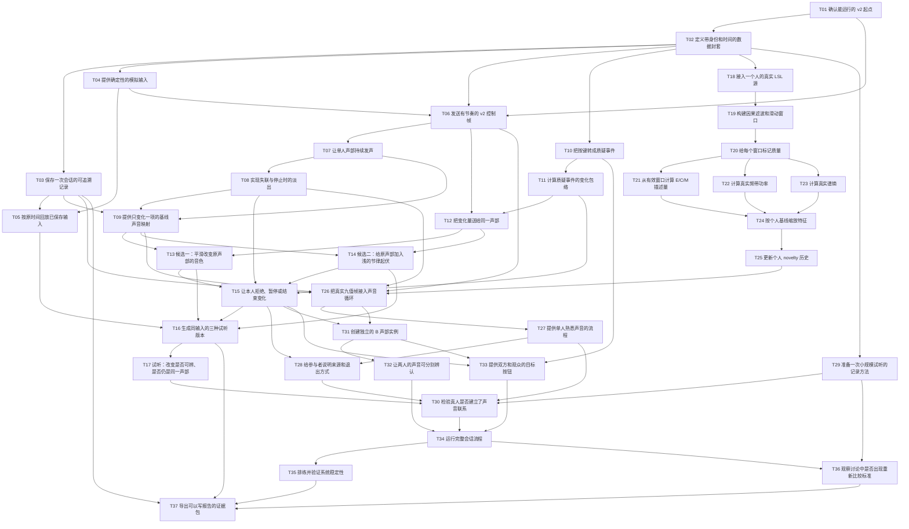

# 完整依赖 DAG

37 个节点、69 条直接依赖；已检查无环。每层最多 5 个并行就绪节点。这里的“可并行”表示依赖允许，不表示必须开启多个代理。

## 按依赖分层

同一层只有在之前各层完成后才全部就绪。也可按 ATOMIC_REQUIREMENTS.md 的 T01–T37 顺序逐项做。

1. T01
2. T02
3. T03, T04, T10, T18, T29
4. T05, T06, T11, T19
5. T07, T12, T20
6. T08, T21, T22, T23
7. T09, T24
8. T13, T14, T25
9. T15, T26
10. T16, T27, T31
11. T17, T28, T32, T33
12. T30
13. T34
14. T35, T36
15. T37
