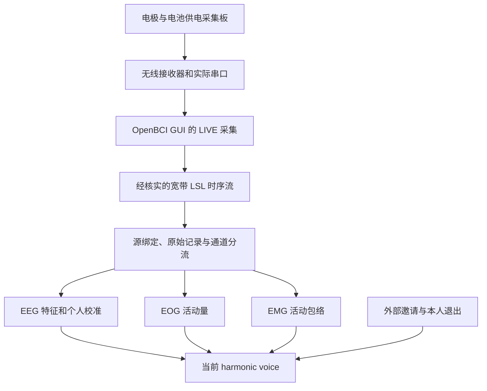

# SDD V1 产品需求：让真人信号驱动现在的声音

更新：2026-09-19。性质：实现需求与验收约定，不是已完成报告。

## 本次更正：硬件已就绪，现在接入

- 依据用户确认及 `Hardware - Tech.md`：硬件早已备齐并配置；不再以查厂商、采购或重新选择通道方案为开工前置。
- 当前配置：Ch1 F3、Ch2 F4、Ch3 C3、Ch4 C4、Ch5 P3、Ch6 P4；Ch7 垂直 EOG；Ch8 咬肌 EMG；耳夹 SRB2 参考与 BIAS。
- 现在就做 T18：启动已有硬件/GUI LIVE，Python 读取真实 LSL。T18 是“收到真数据”；T19–T26 是“从真数据算出当前音乐需要的控制量”。不必等音色设计完成。
- 连接时只核对运行必需项：正确的流、通道对应、采样率、单位、上游滤波是否适用。厂商/固件未知可记录 unknown；遇到兼容或安全问题再追查。
- 硬件就绪不自动等于当前 harmonic voice 已由真人驱动；做一次现场连接验证，不重新证明全部采购和装配。
- 本次仅更新独立文件；原 ZIP 未更新，不要用它覆盖本次文件。

## 1. 这次补什么

SDD 是一个把参与者的生理信号转成持续音乐声部的讨论作品。参与者先熟悉自己的声音；观众或另一位参与者可以邀请他重新考虑比较事物时使用的标准。邀请改变的是同一个声部，而不是另外播放一声警报。参与者可以拒绝、暂停或结束变化。

目前要补的产品链路是：**电极和采集板 → 真实样本 → 分开处理 EEG / EOG / EMG → 当前 harmonic voice → 邀请变化仍然可用**。

“声音像自己的延伸”“能帮助反思”是待体验检验的目标，不是算法已具备的能力。可观察到生理信号影响声音，也不等于系统读出了思想、价值观或反思程度。

## 2. 已有和未完成，分开说

本次静态检查的是用户上传的旧工程导出，不是最新 Windows 工作区；最新进度来自用户粘贴的本地 Codex 报告。实现前必须重新检查实际仓库。

| 层级 | 已有证据 | 不能由此推断的事 |
|---|---|---|
| 当前声音、事件和控制 | 用户报告 T01–T12 完成；提交 `69201bc`、`8d26a4d`；112 tests；本人听到诊断音量降低再恢复 | 不能推出正在读取真实 Cyton，也不能推出已完成最终邀请音色 |
| 旧 LSL 采集 | `src/window_engine.py` 能寻找一个 type=EEG、8 通道的流；旧 `src/eeg_control_demo.py` 有另一条实时入口 | 不能辨明流一定来自真人；不能可靠选择两个参与者；不是当前九值音乐链路的完整验收 |
| 旧身体信号 | `src/body_features.py` 假定前六通道 EEG、第七 EOG、第八 EMG；有滤波/RMS | 通道角色未必符合实际接线；已有函数不代表信号质量、实时滤波、硬件均通过 |
| 旧声音出口 | `src/osc_sender.py` → `/eeg/*`、`/body/*` → `sound/eeg_body_layer.scd` | 这是另一套声音，不能当作当前 harmonic voice 已接通 |
| 原计划 T18–T26 | 写了真实 LSL、滤波、特征、归一化和九值桥接 | 从“已有 LSL 源”起步，缺主板/串口/出口确认；没有完整 EOG/EMG 集成任务 |

结论：复用已有代码，但补齐接入边界和接口；不从零重写，不把 synthetic 跑通当硬件完成。T13–T17 的后续工作没有收到完成报告，须在本地核对。

## 3. 范围和先后

1. 先让一块板的真实 EEG 驱动现有声部，完成掉线、停止和回放验证。
2. 再让配置中独立采集的 EOG、EMG 影响同一声部，逐路试听。
3. 与 invitation 叠加，保留本人拒绝/暂停权。
4. 第一位参与者稳定后，才复制到第二套独立设备和声部。

本轮不做：价值观分类器、自动识别“已经反思”、全自动伪影去除、从头写 Cyton 串口协议、用机器测试代替归属感评价。也不要求先完成整个声音设计才能接真信号。

## 4. 现实采集链路

首选复用路径：

沿用用户已搭好的 Cyton 兼容板、接收器和 OpenBCI GUI，不重新选型。标准无线 Cyton 是 8 路、250 samples/s；连接时读取实际流参数，不必先搜齐厂商历史与固件细节。[官方上手](https://docs.openbci.com/GettingStarted/Boards/CytonGS/)、[数据格式](https://docs.openbci.com/Cyton/CytonDataFormat/)

### 接入前必须记录

- 使用现有可用接收器和 COM 口；厂商/固件能取得就记，未知不阻止标准 LSL 接入。不能写死示例 COM3。
- GUI 版本、LIVE / synthetic / playback 模式、实际启用的通道、增益、参考和 BIAS 配置。
- LSL 的 name、type、source_id、uid、host、通道数、标称/观察到的采样率、单位、上游滤波状态。
- 哪个程序独占串口。首选 GUI 占串口、Python 只读 LSL；不能让 GUI 与 BrainFlow 同时抢同一 COM。
- 采样时间、Python 到达时间、会话单调时钟之间的转换方法；保留原始时间，不对 LSL 重复校时。

**LSL 只是数据输送方式，不是“真人认证”。** GUI 的 synthetic 也能发出看起来像 EEG 的流。必须同时有配置记录、操作者确认、真实采集观察和受控停流验证。

### 如果 GUI 出口不适用

先检查安装版本中 LSL Time Series 到底输出未滤波还是已滤波数据、单位和通道顺序。若已经统一做了 EEG 窄带滤波，不能在 Python 里恢复丢掉的 EMG 频率或 delta。

此时暂停该路线的“合格”认定，记录原因，再选择 GUI 可用的宽带输出，或经用户确认切换 **BrainFlow 直接读串口**。适配器向下游输出同一内部样本合同。不要为了预防所有情况同时实现两套后端。[GUI 数据出口与硬件设置](https://docs.openbci.com/Software/OpenBCISoftware/GUIWidgets/)、[BrainFlow 支持设备](https://brainflow.readthedocs.io/en/stable/SupportedBoards.html)

## 5. 通道不是信号名称：以实际接线为准

| 采集配置 | 通道分配 | 使用条件 |
|---|---|---|
| `mixed_6eeg_1eog_1emg`，当前已确认 | 1–6 F3/F4/C3/C4/P3/P4，7 垂直 EOG，8 咬肌 EMG | 采用用户给出的装配，不再询问是否买齐；连接时确认软件通道/启用状态与之相符 |
| `eeg_only_8`，非当前配置 | 1–8 EEG | 仅作以后主动变更的备选；这次不切换，也不要求先实现它 |
| 临时单通道调试 | 明确指定一条合格 EEG，其他禁用 | 只验收最小真实链路；不是完整混合信号 V1 |

一块 8 通道板不能同时提供 8 EEG + 1 EOG + 1 EMG。参考/BIAS 接点不是额外采样通道，板的辅助加速度字段也不是额外 EMG 通道。

EOG/EMG 的接线与共参考 EEG 不一定相同。记录每路测量电极/参考方式、启用状态、增益；**本文件不对未确认的兼容板下发引脚、SRB 或固件修改指令**。先查实际厂商说明，再由操作者确认。官方 EMG 示例说明了差分电极与 SRB2 设置的区别，但不能盲目应用到整块混合配置。[OpenBCI EMG 设置](https://docs.openbci.com/GettingStarted/Biosensing-Setups/EMGSetup/)

## 6. 内部信号合同

每个原始样本块至少包含：session、participant、source/provenance、sample timestamps、arrival time、单位、采样率、通道标签/角色、数值矩阵、有效性及理由。声明矩阵方向，适配器统一为 samples × channels。

- 先保存收到的样本与源元数据，再滤波；已经在 GUI 处理过的数据只能称“接收时原始数据”，不能称板端原始 ADC。
- 包计数器存在就保存；LSL 出口未提供就标 unavailable，不能伪造丢包精确数。
- disabled、flatline、饱和、缺样、非有限值、时间倒退、过期、源切换分开记录；不能统统转成 0 后当有效数据。
- 对 LSL/BrainFlow 分别记录时间域和单位变换。BrainFlow 用其板级通道索引 API，不假定返回矩阵前八行就是八路信号。[BrainFlow 数据格式](https://brainflow.readthedocs.io/en/stable/DataFormatDesc.html)、[LSL 校时](https://labstreaminglayer.readthedocs.io/info/time_synchronization.html)
- 采集、记录、特征计算、音频发送不互相无限阻塞。队列有上限，溢出留日志；声音只用最新有效状态，不追赶播放积压帧。
- 断流/源变化后重置需要连续输入的滤波状态、窗口和 novelty 历史；重新暖机，不续用旧样本制造“实时变化”。

## 7. 真实信号怎样进入当前声音

### EEG：替换合成输入，保留声音引擎

只用配置为 EEG 且有效的通道。EOG/EMG 不进入 EEG 平均、频带功率或 novelty。

| 音乐链路需要什么 | 真信号计算要求 | 音乐端的去向 |
|---|---|---|
| energy | 定义是 RMS、方差还是现有另一描述量；写清单位、窗口、参考频段和汇总方法并用已知信号测试 | 复用当前 energy 映射；先单独验证，不默认所有指标都同时开放 |
| centroid / mobility | 分别记录谱质心和实际 mobility 公式、频率范围、导数采样间隔；不能仅沿用标签 | 经个人缩放后交给现有选音/保持时间规则；本地审计实际实现 |
| spectral_entropy | 明确频段、PSD、归一化方法；无效与低熵分开 | 现有音乐结构控制，不标作“思维复杂度” |
| delta / theta / alpha / beta | 真实 PSD 积分；明确边界、分母和窗长；前级不得先删掉要计算的低频 | 当前谐波组权重路径；不是四个频段直接播放成可听音高 |
| novelty | 对有效、归一化后的特征更新；每人独立历史 | 当前决策路径；不是“新想法检测器” |

九值帧顺序保持：`energy, centroid, mobility, spectral_entropy, novelty, delta, theta, alpha, beta`。选音消息仍按本地现有六频率＋六权重合同发送。音乐更新频率和 EEG 采样率是两回事；窗口、平滑、调度都会增加延迟。

先使用一个已确认的 EEG 通道或固定的有效通道集合。通道集合改变要有事件并重校准，不能偷偷换平均集合使声音突然变掉。缩放只使用有效个人样本；范围退化就报失败，不把噪声扩成全音域。

### EOG 和 EMG：分开计算，再加入同一声部

以下是候选工程参数，不是最终音乐决定或生理结论。根据实际采样率、上游处理和接线再确认。

| 输入 | 第一版可计算量 | 候选声音用途 | 必须避免 |
|---|---|---|---|
| 独立 EOG | 低频活动的平滑幅度/RMS；旧代码 0.5–10 Hz、2 秒窗可作比较起点 | 小范围改变现有滑音时间或效果湿度；先选一个参数 | RMS 不能解释为看向左/右，更不是反思或确信 |
| 独立 EMG | 限带后的 RMS/整流包络；250 Hz 数据可试 20–90 Hz、约 250 ms RMS，再平滑 | 现有声部的浅节律/包络或纹理密度；先选一个参数 | 这只是有限带宽肌肉活动量，不是完整 EMG 频谱测量，也不是压力/道德紧张度 |

实时实现使用持续状态的因果滤波。旧窗口内 `filtfilt` 不能直接当成已验证的流式滤波；滤波延迟、暖机和缺样重置要测。工频处理取决于现场与频带，不固定复制旧参数。

身体信号映射默认关闭；只有通道已确认、校准合格且明确启用才开放。每次只听一个新增映射，保留未加身体信号的 baseline。不要自动回退到旧 `eeg_body_layer.scd` 来冒充当前声音集成。

### 三类变化不能互相冒充

1. EEG 提供持续的基线控制。
2. EOG/EMG 提供明确标识的身体活动调制。
3. invitation 是别人发出的反思邀请；来源透明，由本人控制是否继续。

新增身体控制使用独立、版本化合同，或复用本地已存在且合格的同类合同；不得把身体字段塞进旧九值帧。至少包含目标、session、sequence、时效和逐模态有效性；发送端/接收端一致测试。

Synth 组合基线、身体调制、邀请调制后再限幅。写明每个声音参数的所有者和组合规则，避免最后一条 OSC 消息覆盖另一路。邀请结束时回到**此刻的 EEG/身体基线**，不是邀请前冻结的一帧。

## 8. 失效策略和真实验收

- EEG 无效：按已记录的短暂容错/淡出策略处理；invalid 帧不刷新 watchdog，EOG/EMG 和 invitation 也不能使坏 EEG 假装仍健康。
- 某路身体信号无效：该路调制平滑回中性；不把零值当肌肉放松，不让它误触发 invitation。
- 整板失联或停止：声部淡出，身体调制和邀请状态安全结束；接回后重新暖机，不自动续播旧邀请。
- 一人的板断开不影响另一人的有效声部。没有两套实际采集验证就不宣称双人硬件完成。

| 验收门 | 必须留的证据 | 不能替代它的东西 |
|---|---|---|
| H07 真实来源 | 实际板/接收器配置、明确 LIVE 模式、带时间的信号片段、停止采集后停止到帧 | 同名 synthetic LSL、随机数据、只有 GUI 截图 |
| H08 通道确认 | 安全的静息/自然眨眼/轻微肌肉动作观察；实际角色、启用和质量记录 | 单靠曲线会动；8 列里混有禁用零值 |
| V01 真 EEG → 当前声音 | 原始样本、特征、九值帧、选音、音频的对应时间；实际声音出现变化 | 用真实流续命但仍发预设特征 |
| B09 真身体信号 → 当前声音 | EEG-only / 加 EOG / 加 EMG 的单独试听与记录 | 肌肉动作污染 EEG 引起变声，却宣称是独立 EMG 路径 |
| V02 断流和回放 | 同记录重算结果可比较；停流/崩溃/重连无陈旧恢复；延迟分段记录 | 只检查 OSC 到达和文件非空 |
| V03 单人完整链路 | 真实三类输入、邀请和本人退出能组合；原因事件和音频相符 | 自动测试通过就勾“自然、像自己、帮助反思” |

EEG 容易受到眼动和肌肉活动污染。初版应标记观察到的污染/可疑片段，并分别记录是否用于声音；不能声称简单滤波已经得到“纯脑信号”。生理身份与归属感的研究结论需要另行验证。

## 9. 安全与资料

这不是医疗设备的诊断应用。人体连接前核对实际厂商安全说明与供电/隔离；本项目验收要求板使用批准的电池方式，佩戴时不充电、不临时增加与市电/USB 的导电连接。硬件不明确时停止人体测试，软件可继续用已标识 fixture 开发。每个人使用独立采集配置，不擅自跨人共参考。

先低音量试听；数字 limiter 和“不削波”不能证明耳边声压安全。软件不得未经告知自动开始真人声音播放。原始生理记录需同意、匿名编号、限定用途；不自动提交 Git、不上传公开附件。

每次保存：硬件/通道配置、版本、依赖、模式、样本和质量事件、特征/映射版本、邀请事件、音频对应时间、操作者实际做了什么、失败与未验证项。用模板写几句设计理由和参考链接即可，不要求把每次调参写成论文。

## 10. 现在的操作顺序

- 使用已搭好的板和接收器，打开现有 GUI 的 LIVE 采集和 LSL 出口。
- 复用旧 LSL 入口，打印八路真实数据、时间和到达率；不先重写采集框架。这就是现在要做的 T18。
- 从流或现有设置读取单位/采样率/通道/滤波；只有会导致接错或算错的信息缺失才停下问具体问题。
- 最短声音验证：一条有效 EEG → 真实 energy → 当前声部已有映射；其他字段明确固定。此时只声称“单映射真实 EEG 接通”。
- 接着完成全部真实九值，再逐路接 EOG/EMG；复用已实现部分，不重做 T01–T12。
- 未完成的连接测试标“当前程序待联调”，不要写成“硬件未准备”。人体安全要求仍然保留。

## 11. 与任务表的关系

保留 T01–T37 编号；H 系列补现实采集，B 系列补身体信号，V 系列补真实链路验收。先前成功提交不回滚，旧输入/声音协议不随意改名。`requirements.json` 是依赖事实源，`ATOMIC_REQUIREMENTS.md` 是可阅读版本，`NEXT_CODEX_TASK.md` 指定下一次本地工作的停止边界。
